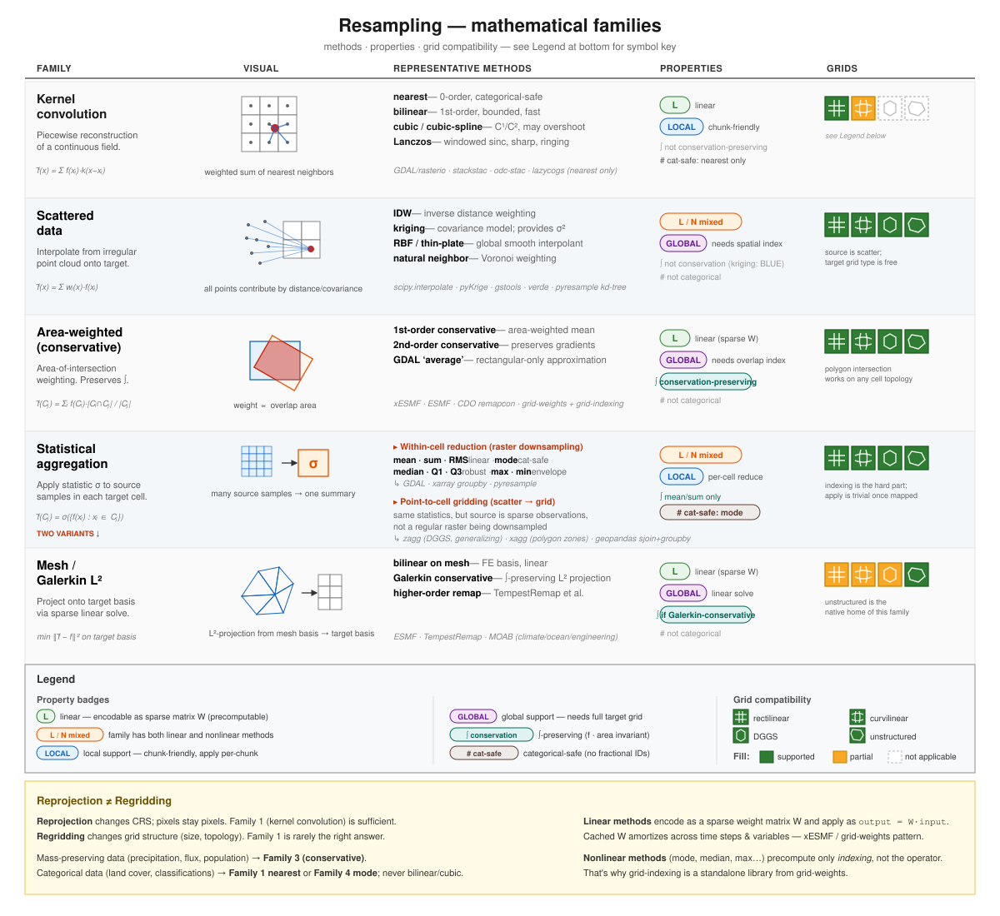
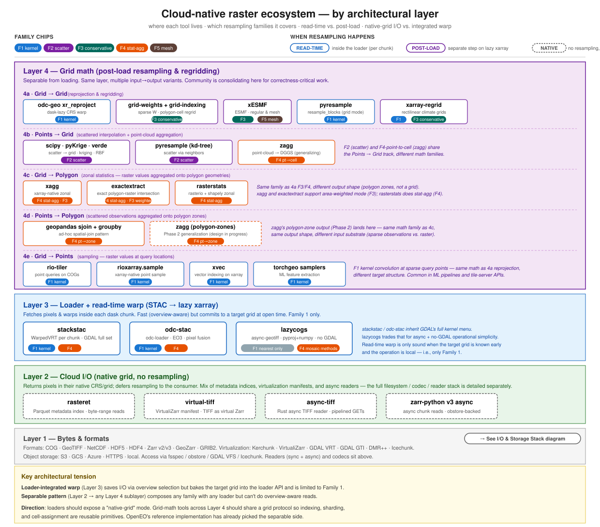

## 1. Why this page

The core of this site is a set of **benchmarks** for Web Mercator tile generation on continuous gridded data — a narrow, well-scoped slice of the "resampling" problem space. This page is the *positioning layer* underneath those benchmarks: it frames where they sit within the broader ecosystem of cloud-native geospatial resampling tooling, and it tracks what we plan to add so the site can grow into the broader survey it's often treated as.

Two audiences:

- **Practitioners choosing a resampling tool** should read §2 (the math), §3 (the tool landscape), §4 (what these benchmarks actually measure), and §7 (a decision grid).
- **People citing this site** should read §4 and §8 to scope the citation correctly.

## 2. Mathematical families

"Resampling" collapses at least five mathematically distinct operations. Picking the wrong family is silent and common; the library can't catch the error — only the user knows what the data means.

| Family | Operation | Key properties |
|---|---|---|
| **F1 Kernel convolution** | reconstruct a continuous field from samples, sample at target | linear, local, not conservation-preserving, only nearest is categorical-safe |
| **F2 Scattered-data** | irregular points → grid via distance/covariance weighting | mixed linearity, global, needs spatial index |
| **F3 Conservative** | area-weighted polygon intersection | linear (sparse W), global, preserves ∫ |
| **F4 Statistical aggregation** | apply σ to source samples per cell (two variants — see below) | mixed linearity, local, conservation for mean/sum, cat-safe for mode |
| **F5 Mesh / Galerkin L²** | project onto target basis by sparse linear solve | linear, global, can be conservative |

### F4 is really two operations

- **Within-cell reduction** (raster downsampling) — source is a dense grid; statistics collapse contributing pixels. Tools: GDAL (mode/med/q1/q3/max/min/sum/rms), xarray groupby, pyresample.
- **Point-to-cell gridding** (scattered → grid) — source is sparse observations; statistics populate a grid from scratch. Tools: zagg (DGGS/generalizing), xagg (polygon zones), geopandas sjoin+groupby.

Same statistic family, different pipelines. Most libraries expose only one variant.

### Cross-cutting axes

- **Linearity**: linear methods encode as a sparse weight matrix **W** and apply as `output = W · input`; **W** caches across time steps and variables. Nonlinear methods (mode, median, max, quantile) cache only *indexing*, not the operator. This is why grid-indexing and grid-weights are separate libraries.
- **Support**: local (kernel has finite support → chunk-friendly) vs. global (needs full target grid spec before weights can be built).
- **Conservation**: preserves ∫? F3 and F4-mean/sum only.
- **Categorical safety**: nearest (F1) and mode (F4) only. Bilinear/cubic/Lanczos on class IDs produces fractional nonsense.

### Reprojection ≠ regridding

- **Reprojection**: change CRS, keep pixel semantics. F1 works.
- **Regridding**: change grid structure (size, topology). Mass-preserving data → F3. Categorical data → F1 nearest or F4 mode. Continuous data → F1 bilinear/cubic or F2.

Conflating the two is the source of most silent resampling errors.

## 3. Architectural layers

| Layer | Role | Exemplar tools |
|---|---|---|
| **1. Bytes & formats** | COG, GeoTIFF, NetCDF, HDF5, HDF4, Zarr v2/v3, GeoZarr; virtualization formats (Kerchunk JSON/Parquet, VirtualiZarr manifest, GDAL VRT, GDAL GTI, DMR++); on cloud object storage | see the [I/O & Storage Stack](io-stack.qmd) page for full detail |
| **2. Native-grid I/O** | loaders that return pixels in native CRS, no resampling; sits atop a deep I/O stack (filesystem, codecs, readers, xarray backends) | rasteret, virtual-tiff, async-tiff, zarr-python v3 async · see [I/O & Storage Stack](io-stack.qmd) |
| **3. Loader + read-time warp** | integrated resampling per dask chunk; Family 1 only | stackstac, odc-stac, lazycogs |
| **4. Grid math (post-load)** | separable from I/O; five input→output sublayers (see below) | see 4a–4e |

Layer 4 is a container for five parallel sublayers — same architectural layer, different input→output combinations. Each row has its own math, tooling, and use cases; they share only the "post-load, runs on a lazy xarray" pattern.

| Sublayer | Input → Output | Exemplar tools |
|---|---|---|
| **4a Grid → Grid** | reprojection & regridding | odc-geo xr_reproject, grid-weights + grid-indexing, xESMF, pyresample (grid mode), xarray-regrid |
| **4b Points → Grid** | scattered interp + point-cloud aggregation | scipy / pyKrige / verde, pyresample (kd-tree), zagg |
| **4c Grid → Polygon** | zonal statistics on polygon geometries | xagg, exactextract, rasterstats |
| **4d Points → Polygon** | scattered observations aggregated onto polygon zones | geopandas sjoin + groupby, zagg (polygon-zones, Phase 2) |
| **4e Grid → Points** | sampling — raster values at query locations | rio-tiler, rioxarray.sample, xvec, torchgeo samplers |

### Two architectural patterns in tension

- **Loader-integrated warp** (Layer 3) saves I/O via overview selection but bakes the target grid into the loader API and is limited to Family 1.
- **Separable pattern** (Layer 2 → any Layer 4 sublayer) composes any family with any loader; pays for I/O at native resolution but has no family restriction.

The Pangeo / OpenEO community is consolidating on the separable pattern for correctness-critical work. [A Pangeo thread from Sep 2024](https://discourse.pangeo.io/t/can-a-reprojection-change-of-crs-operation-be-done-lazily-using-rioxarray/4420) established that `odc-geo.xr.xr_reproject` is the current canonical tool for lazy, dask-aware CRS warp on xarray — and the OpenEO reference implementation uses it for `resample_spatial`. `rioxarray.reproject()` breaks laziness by calling GDAL synchronously on the full array; don't use it for large cloud arrays.

## 4. Scope of current benchmarks

The benchmarks on this site measure a specific slice of the space above.

**Tools profiled**: rasterio, rioxarray, pyresample, xesmf, xesmfcached, odc-geo xr_reproject, xcube, geowombat, xcdat.

**Datasets**: MUR SST, GPM IMERG. Both continuous.

**Workload**: Web Mercator tile generation (Z0–6).

**Metrics**: wall-time + peak heap memory (memray / pyinstrument).

**Variability axes**: I/O backend (h5netcdf vs zarr-icechunk vs rasterio), storage (local vs S3), format optimizations (overviews, Zarr virtualization).

### Current findings

1. **GDAL-backed tools dominate on speed + memory** (odc-geo, rioxarray). Consistent across I/O backends.
2. **I/O choice matters more than algorithm.** Virtualization + overviews beat algorithm micro-optimizations by factors of 2–20.
3. **xESMF is slowest without cached weights.** With pre-computed weights it becomes competitive; without them it pays for weight construction every run.
4. **The lazy-vs-eager axis is hidden.** Every run calls `.load()` on the result, so the cost of dask graph construction vs. materialization is not isolated.

### What these findings don't say

The scope above means these benchmarks **cannot** speak to:

- **F3 conservative regridding** of mass-preserving data. GDAL-nearest/bilinear is fast but *incorrect* for precipitation, population density, or flux.
- **Categorical data.** Nearest at any non-matching scale silently corrupts land-cover statistics.
- **Large-scale workloads.** Z0–6 tiles are tens of MB; scaling behavior to full scenes, time-series stacks, or continental mosaics is untested.
- **Async-native I/O paths.** `lazycogs`, `async-tiff`, and similar no-GDAL pipelines are not in the benchmark set.
- **Layer 4 sublayers beyond 4a.** Points → grid (`zagg`, scattered-data interp), grid → polygon zonal stats (`xagg`, `exactextract`, `rasterstats`), points → polygon aggregation, and grid → points sampling (`rio-tiler`, `rioxarray.sample`, `xvec`, `torchgeo` samplers) are all untested here.
- **Correctness.** The site measures time and memory; whether two tools produce the *same* output for the same task is not verified.

## 5. Roadmap

What we plan to add, prioritized by impact on the breadth-of-authority the site is often cited for.

### Tier 1 — closes the widest gap

- **F3 conservation scenario with a conservation-error metric.** Dataset candidate: GPCP precipitation or TerraClimate aggregated to a coarser target. Tools: xESMF conservative, grid-weights, xarray-regrid conservative, CDO remapcon, plus GDAL `average` as the rectangular approximation for contrast. Metric: `|Σ input·area − Σ output·area| / Σ input·area`.
- **Categorical scenario with class-frequency divergence.** Dataset: ESA WorldCover or USDA CDL; downsample by 4×–10×. Tools: rasterio `nearest` / `mode`, rioxarray, gdalwarp `-r mode`, xarray groupby-mode. Metric: KL divergence or histogram delta against a scale-aware reference.
- **Correctness as a first-class metric across all scenarios.** MAE/RMSE for continuous (vs. GDAL warp with Lanczos as reference); conservation-error for mass-preserving; class-frequency divergence for categorical; gradient-magnitude artifacts for smooth reprojection.

### Tier 2 — scope extensions

- **Lazy-vs-eager isolation.** Same tool, same data, run as lazy-constructed / dask-distributed-computed / `.load()`ed. Directly serves the Pangeo thread above.
- **Scale axis.** Full Sentinel-2 scene (10980² at 10 m), time-series stack (50–100 scenes), continental mosaic. Surfaces divergence that Z0–6 tiles hide.
- **Async-native paths.** Add `lazycogs` (F1 nearest), `async-tiff`-backed experiments. Test whether removing GDAL's threading/env complexity translates to throughput at scale.
- **Layer 4 sublayer benchmarks.** Expand beyond 4a (grid → grid): add 4b Points → Grid (`zagg`, `pyresample` kd-tree, `verde`), 4c Grid → Polygon zonal stats (`xagg`, `exactextract`, `rasterstats`), 4d Points → Polygon (`geopandas.sjoin + groupby`), and 4e Grid → Points sampling (`rio-tiler`, `rioxarray.sample`, `xvec`, `torchgeo` samplers). Points/sec or samples/sec, memory, correctness vs. reference.

### Tier 3 — delivered by this page

- **Taxonomy overview.** §2 and §3 above.
- **Coverage matrix.** §6 below.
- **Recommendations table.** §7 below.
- **Explicit citation guidance.** §8 below.
- **Synthetic / no-auth dataset** for CI and external contributors — planned alongside Tier 1.

## 6. Coverage matrix

Which tools are benchmarked today, and which families they can cover in principle. Green = benchmarked; yellow = exists in tool but not yet tested; grey = out of scope for the tool. The Sublayer column indicates where each tool primarily lives in Layer 4 (see [Architectural layers](#3-architectural-layers)); tools can appear in multiple sublayers where applicable.

| Tool | Sublayer | F1 kernel | F2 scatter | F3 conservative | F4 stat-agg | F5 mesh | Native-grid I/O |
|---|---|:---:|:---:|:---:|:---:|:---:|:---:|
| **rasterio** | 4a | ✅ | — | 🟡 (`average`) | 🟡 (`mode`, `med`) | — | — |
| **rioxarray** | 4a | ✅ | — | 🟡 | 🟡 | — | — |
| **odc-geo xr_reproject** | 4a | ✅ | — | — | 🟡 | — | — |
| **pyresample (grid mode)** | 4a | ✅ | — | — | 🟡 | — | — |
| **pyresample (kd-tree)** | 4b | — | 🟡 | — | — | — | — |
| **xESMF** | 4a | 🟡 (bilinear) | — | 🟡 | — | 🟡 | — |
| **xcube** | 4a | ✅ | — | 🟡 | — | — | — |
| **geowombat** | 4a | ✅ | — | — | — | — | — |
| **xcdat** | 4a | ✅ | — | — | — | — | — |
| **xarray-regrid** | 4a | — | — | 🟡 | — | — | — |
| **grid-weights + grid-indexing** | 4a | — | — | 🟡 | — | — | — |
| **scipy / pyKrige / verde** | 4b | — | 🟡 | — | — | — | — |
| **zagg** | 4b (→ 4d in Phase 2) | — | — | — | 🟡 (pt→cell; pt→zone planned) | — | — |
| **xagg** | 4c | — | — | 🟡 (weighted mode) | 🟡 (zonal stats) | — | — |
| **exactextract** | 4c | — | — | 🟡 (exact weighted) | 🟡 (zonal stats) | — | — |
| **rasterstats** | 4c | — | — | — | 🟡 (zonal stats) | — | — |
| **geopandas sjoin + groupby** | 4d | — | — | — | 🟡 (pt→zone) | — | — |
| **rio-tiler** | 4e | 🟡 (sampling) | — | — | — | — | — |
| **rioxarray.sample** | 4e | 🟡 (sampling) | — | — | — | — | — |
| **xvec** | 4e | 🟡 (sampling) | — | — | — | — | — |
| **torchgeo samplers** | 4e | 🟡 (sampling) | — | — | — | — | — |
| **lazycogs** | Layer 3 | — | — | — | — | — | 🟡 |
| **virtual-tiff** | Layer 2 | — | — | — | — | — | 🟡 |
| **rasteret** | Layer 2 | — | — | — | — | — | 🟡 |

Right column covers Layer 2 (native-grid I/O). Yellow entries in the other columns are the bulk of the Tier 1/2 roadmap. Tools appear in one primary sublayer; some (e.g., pyresample, zagg) fan out across multiple sublayers and are listed in each.

## 7. Recommendations by data semantics

Picking a tool from the right family matters more than picking the fastest tool in a family.

| Data semantics | Target | Recommended tool(s) | Primary tradeoff |
|---|---|---|---|
| **Continuous**, CRS warp → tile output | Web Mercator tiles | `odc-geo.xr_reproject` or `rioxarray.reproject` | GDAL speed; F1 only |
| **Continuous**, CRS warp → analysis-ready xarray | any | `odc-geo.xr_reproject` (lazy) | separable, dask-aware; F1 only |
| **Mass-preserving** (precip, flux, population) → new grid | any | xESMF conservative (cached W), or `grid-weights` | precompute cost amortizes across time |
| **Mass-preserving** → rectilinear climate grid | regular lat/lon | `xarray-regrid` conservative | simpler API; rectilinear only |
| **Categorical** (land cover, classifications) | any scale change | only `mode`-capable tools; GDAL `mode`, rasterio, rioxarray | correctness non-negotiable |
| **Scattered observations** → grid | any | `pyresample` kd-tree (IDW/nearest) or `verde` (spline/kriging) | kriging gives σ²; IDW is cheaper |
| **Scattered observations** → DGGS | HEALPix, H3, S2 | `zagg` | serverless fan-out; point-cloud scale |
| **Scattered observations** → polygon zones | any zones | `zagg` (Phase 2), or `geopandas.sjoin + groupby` for small data | zagg scales; geopandas is local-only |
| **Raster → polygon zonal stats** | any polygon set | `exactextract` (fastest, exact), `xagg` (xarray-native), `rasterstats` (simple) | exactextract for production; xagg for xarray workflows |
| **Raster → point sampling** (ML features, validation) | any query points | `rioxarray.sample`, `xvec`, `rio-tiler` (COGs), `torchgeo` samplers (ML) | xvec is newest; torchgeo for ML pipelines |
| **Legacy TIFFs** → chunked / lazy-array access | virtual chunks via Zarr API | `virtual-tiff` | zero-copy VirtualiZarr manifest over TIFF bytes |
| **STAC archive** → lazy xarray, tile-like output | small AOI | `stackstac`, `odc-stac`, or `lazycogs` (no-GDAL) | read-time warp; F1 only |

## 8. How to cite this site

The site is at its most useful when cited with its scope made explicit.

**Recommended framing**: *"Tile-generation benchmarks for Family 1 (kernel convolution) on continuous gridded data, targeting Web Mercator output."*

**For a broader ecosystem review**, cite this `ecosystem.qmd` page rather than an individual benchmark notebook. This page frames current scope, planned additions, and positions all the tools in a common taxonomy.

**What to avoid**: citing narrow time/memory findings as general claims about a tool's correctness or fitness. "GDAL wins" is a true finding *within* the scope — it's not a universal claim. Tools that the benchmark marks as "slow" (e.g., xESMF without cached weights) are often the only correct choice for workloads the benchmark doesn't cover (mass-preserving regridding).

## 9. References

### Ecosystem discussions
- [Sean Harkins' proposal for modular libraries (gist)](https://gist.github.com/sharkinsspatial/f1c3a8f871b58416fa30c377178b5f9c) — separating I/O, indexing, and resampling into composable Rust-based libraries; proposes a generic transform-aware indexing library and a chunkwise resampling library.
- [Pangeo thread on lazy reprojection (Sep 2024)](https://discourse.pangeo.io/t/can-a-reprojection-change-of-crs-operation-be-done-lazily-using-rioxarray/4420) — community consensus on `odc-geo.xr.xr_reproject` for lazy, dask-aware CRS warp.

### Loader + read-time warp (Layer 3)
- [`stackstac`](https://github.com/gjoseph92/stackstac) — STAC → lazy xarray via `rasterio.vrt.WarpedVRT` per chunk.
- [`odc-stac`](https://github.com/opendatacube/odc-stac) — STAC → lazy xarray via odc-loader; EO3 metadata; pixel fusion.
- [`lazycogs`](https://github.com/hrodmn/lazycogs) — STAC → lazy xarray with async-geotiff backend; no GDAL dependency.

### Native-grid I/O (Layer 2)
- [`virtual-tiff`](https://github.com/earth-mover/virtual-tiff) — VirtualiZarr 2.0 manifest over TIFFs; zero-copy Zarr view.
- [`rasteret`](https://github.com/rasteret/rasteret) — pre-built Parquet metadata index; byte-range reads via obstore.

### Layer 4a — Grid → Grid
- [`odc-geo`](https://github.com/opendatacube/odc-geo) — `GeoBox` abstraction; `xr_reproject` for lazy CRS warp.
- [`grid-indexing`](https://github.com/keewis/grid-indexing) — Rust R*-tree cell-overlap indexing.
- [`grid-weights`](https://github.com/keewis/grid-weights) — area-weighted conservative regridding; uses grid-indexing.
- [`xESMF`](https://github.com/pangeo-data/xESMF) — ESMF-backed regridding for rectilinear and mesh.
- [`pyresample`](https://github.com/pytroll/pyresample) — kd-tree and resample_blocks backends (grid-mode entry here; kd-tree entry in 4b).
- [`xarray-regrid`](https://github.com/xarray-contrib/xarray-regrid) — rectilinear climate grid regridding.

### Layer 4b — Points → Grid
- [`pyresample` kd-tree](https://github.com/pytroll/pyresample) — scattered-to-grid via nearest-neighbor or weighted kernels.
- [`scipy.interpolate`](https://docs.scipy.org/doc/scipy/reference/interpolate.html) — generic scatter interpolation (griddata, RBF).
- [`pyKrige`](https://github.com/GeoStat-Framework/PyKrige) — ordinary/universal kriging with σ² output.
- [`verde`](https://github.com/fatiando/verde) — spline- and greens-function-based gridding; Fatiando ecosystem.
- [`zagg`](https://github.com/englacial/zagg) — cloud-native point-cloud → DGGS aggregation; serverless fan-out. Generalizing to arbitrary output grids (Phase 2 → polygon zones, see Layer 4d).

### Layer 4c — Grid → Polygon (zonal statistics)
- [`xagg`](https://github.com/ks905383/xagg) — xarray-native zonal aggregation; area-weighted mode available.
- [`exactextract`](https://github.com/isciences/exactextract) — C++-backed exact polygon-raster intersection; fastest in class. Python bindings.
- [`rasterstats`](https://github.com/perrygeo/python-rasterstats) — rasterio + shapely zonal stats; simple pure-Python.

### Layer 4d — Points → Polygon
- `geopandas.sjoin + groupby` — ad-hoc spatial-join pattern; works for small-to-medium data.
- [`zagg`](https://github.com/englacial/zagg) (Phase 2 polygon-zones) — point-cloud → polygon aggregation with serverless fan-out.

### Layer 4e — Grid → Points (sampling)
- [`rio-tiler`](https://github.com/cogeotiff/rio-tiler) — point queries on COGs; tile-server-style API.
- [`rioxarray.sample`](https://corteva.github.io/rioxarray/) — xarray-native point sampling from rasters.
- [`xvec`](https://github.com/xarray-contrib/xvec) — vector-geometry indexing on xarray; growing adoption.
- [`torchgeo`](https://github.com/microsoft/torchgeo) samplers — ML feature-extraction workflow wrappers.

### Standards
- [xdggs](https://github.com/xarray-contrib/xdggs) — DGGS Zarr metadata specification.
- [GeoZarr](https://github.com/zarr-developers/geozarr-spec) — rectilinear/CF Zarr metadata.
- [STAC](https://stacspec.org) — SpatioTemporal Asset Catalog.

### Related reviews
- [CF Conventions](https://cfconventions.org/) — baseline for coordinate/axis metadata.

---

*This page will evolve as the benchmark scope and the broader ecosystem change. Open an issue or PR at [github.com/developmentseed/warp-resample-profiling](https://github.com/developmentseed/warp-resample-profiling) to propose additions or corrections.*
