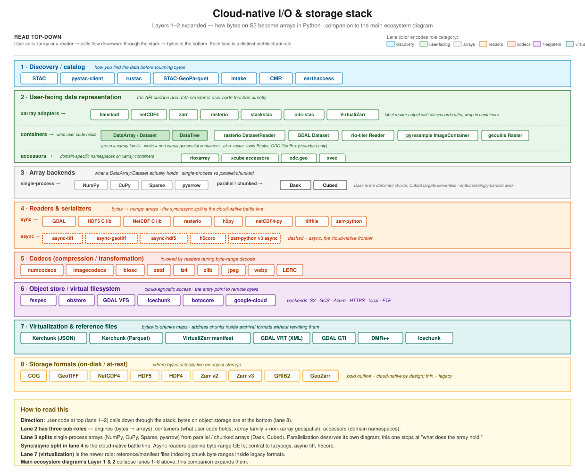

## Why this page

The main [Ecosystem & Roadmap](ecosystem.qmd) diagram treats Layers 1 and 2 (bytes and native-grid I/O) as two thin rows. In reality, a lot happens between an S3 object and an `xr.open_dataset(...)` call. This page expands that region of the stack.

The goal is to make visible: (a) which tools serve which architectural role, (b) where the sync/async divide falls, (c) where virtualization fits relative to formats and readers, and (d) which tools cross roles. If you're trying to place a new tool or pick between existing ones, this is the page to read first.

## The stack

## Reading direction

User code sits at the top. A call like `xr.open_dataset(store)` or `rasterio.open(uri)` flows downward through the stack:

1. **Discovery** (if you don't already know the URI): STAC, pystac-client, CMR, earthaccess.
2. **User-facing data representation**: xarray adapters (what the codebase calls "engines") that label reader output; accessors that add domain-specific namespaces; containers that hold the result.
3. **In-memory array backends**: the actual in-memory representation the DataArray wraps.
4. **Readers & serializers**: C libraries or Python readers that turn bytes into arrays. Sync and async variants diverge here.
5. **Codecs**: invoked by readers to decompress or de-transform byte ranges.
6. **Object store / virtual filesystem**: cloud-agnostic access; sits between readers and the actual storage.
7. **Virtualization & reference files**: byte-range-to-chunk maps that make legacy formats look like Zarr. Optional layer — only present when virtualization is used.
8. **Storage formats**: what's at rest on object storage.

The diagram is a reference atlas, not a call graph — not every call visits every lane (virtualization is optional; some codecs are built into format readers; discovery can be skipped when you already have a URI). Treat the layers as slots that may or may not be filled for a given workflow.

## What's genuinely architectural (vs. just a tool choice)

Four observations that the diagram surfaces:

### The sync/async divide in lane 4 is a cloud-native battle line

Sync readers block on every byte-range GET. Async readers (`async-tiff`, `async-geotiff`, `async-hdf5`, `h5coro`, `zarr-py v3 async`) pipeline many GETs concurrently — crucial when latency, not throughput, dominates (cloud object storage). The async lane's dashed borders in the diagram highlight this frontier. It's also the layer where lazycogs's no-GDAL bet lives.

GDAL's own async story has historically been weaker; many of the async entries are clean-room Rust-backed readers that skip GDAL entirely. This is a real architectural divergence, not a style preference.

### Virtualization (lane 7) is a genuinely new architectural role

Five years ago the stack was: reader → format. Virtualization inserts a byte-range map between them: reader → virtualization manifest → format. It looks like another format from above (Zarr-compatible interface) and like another client from below (fetches byte ranges from the original file). This is why VirtualiZarr, Kerchunk, and GDAL VRT/GTI are a first-class lane: they're not a variant of format or reader, they're an architectural middleman.

Icechunk is a hybrid case — it's a virtualization format *and* an object-store-like repository, hence it appears in both lane 6 (object store / VFS) and lane 7.

### Object stores have consolidated around fsspec vs. obstore

`fsspec` is the incumbent filesystem abstraction. `obstore` is the Rust-backed, async-first challenger. Most cloud-native projects now choose between them, and the choice correlates strongly with sync-vs-async readers in lane 4: sync tools use fsspec, async Rust tools use obstore. GDAL's VFS is a third option, architecturally separate because it's embedded in GDAL.

### User-facing data representation (lane 2) has three drawn sub-roles — and a fourth invisible one

Lane 2 is the API surface user code touches directly. It covers three sub-roles visibly and a fourth implicitly:

- **Xarray adapters** (`h5netcdf`, `netCDF4`, `zarr`, `rasterio`, `stackstac`, `odc-stac`, `VirtualiZarr`) register via the `xarray.backends` entry point. Their distinctive work is **labeling**: parsing format-specific metadata (HDF5 dimension_scales, GeoTIFF affine transform + CRS, Zarr `_ARRAY_DIMENSIONS` attrs, CF conventions for `_FillValue` / scale / offset) and translating it into xarray's conventions — dimension names, coordinate arrays, attributes — then wrapping the reader's output in a `DataArray` or `Dataset`. A rasterio reader gives you a `(bands, y, x)` ndarray plus a transform and CRS string; the rasterio adapter turns that into a DataArray with named `band/y/x` dims, coord arrays computed from the transform, and a spatial reference attribute. The interpretation work is the distinctive part — wrapping is the obvious part. Triggered by `xr.open_dataset(..., engine=...)`. *(The xarray codebase calls these "engines"; "adapter" is more architecturally accurate because the work is a Gang-of-Four Adapter — bridging one interface to another.)*
- **Containers** — the actual data structures users hold and operate on. The xarray family (`DataArray`, `Dataset`, `DataTree`) plus non-xarray geospatial containers (`rasterio.DatasetReader`, `GDAL.Dataset`, `rio-tiler.Reader`, `pyresample.ImageContainer`, `geoutils.Raster`, `raster_tools.Raster`, and metadata-only `odc.geo.GeoBox`). The non-xarray containers are shown to honest-ly represent the cloud-native raster ecosystem, not just the xarray world.
- **Accessors** (`rioxarray`, `xcube accessors`, `odc.geo`, `xvec`) register via accessor-registration hooks and add namespaces (`.rio`, `.xcube`, `.odc`, `.xvec`) to xarray containers for domain-specific operations. Invoked as method-like calls: `da.rio.reproject(...)`.
- **ChunkManager plugins** — a fourth extension pattern that's not drawn because it's internal dispatch plumbing. Registered via the `xarray.chunkmanagers` entry-point group, these are dispatch adapters connecting xarray's API surface to a specific chunked-array library's parallel primitives. They implement a ~15-method ABC (`ChunkManagerEntrypoint` in `xarray/namedarray/parallelcompat.py`) covering `from_array`, `rechunk`, `compute`, `persist`, `reduction`, `scan`, `map_blocks`, `blockwise`, `apply_gufunc`, `shuffle`, `store`, `normalize_chunks`, `get_auto_chunk_size`, and `array_api`. xarray ships `DaskManager` internally; [`cubed-xarray`](https://github.com/xarray-contrib/cubed-xarray) provides `CubedManager`. Invisible to user code — you never import cubed-xarray; xarray discovers it via entry points when you pass `chunked_array_type='cubed'` or when Dask isn't installed.

The four patterns are frequently conflated. They're architecturally distinct:

| Pattern | Registered via | User-facing call | Job |
|---|---|---|---|
| Xarray adapter (= "engine") | `xarray.backends` entry point | `xr.open_dataset(engine=...)` | label reader output (dims / coords / attrs) and wrap in containers |
| Container | (core class or third-party class) | construction / receiving from adapters | hold the data |
| Accessor | accessor decorator / entry point | `da.NAMESPACE.method()` | add domain-specific methods |
| ChunkManager | `xarray.chunkmanagers` entry point | *(indirect — via `.compute()`, `.mean()`, `.chunk()`, etc.)* | dispatch parallel primitives to Dask or Cubed |

### Why Lane 2 adapters and Lane 4 readers share names

`rasterio` appears in both Lane 2 (as an xarray adapter) and Lane 4 (as a sync reader). `zarr`, `h5netcdf`-via-`h5py`, `netCDF4`-via-`netCDF4-py` follow the same pattern. These aren't duplicate drawings — they're one package playing two distinct architectural roles:

- Lane 4 `rasterio` reads bytes and returns raw arrays (plus format metadata like affine transform and CRS).
- Lane 2 `rasterio` adapter takes that output and labels it into an xarray DataArray.

The adapter could in principle be a separate package (e.g., the rasterio adapter lives in `rioxarray` for much of the work), but xarray's entry-point system registers them under the same logical name for users. Showing both lanes makes the two roles visible, which is the point.

### stackstac, odc-stac, and VirtualiZarr: adapters that do more

Three adapter entries in Lane 2 aren't just 1:1 with a Lane-4 reader:

- **stackstac** and **odc-stac** are *multi-file* adapters. They take a list of STAC items and orchestrate many rasterio reads into one lazy, chunked DataArray. They fit the adapter pattern (call readers, label output, wrap in container) but the "call readers" step is plural. In the main ecosystem diagram they're Layer 3 (loader + read-time warp) — this is the same thing viewed from a different angle.
- **VirtualiZarr** is an adapter that reads via a manifest (Lane 7). The novel artifact is the manifest format; the adapter is mostly standard zarr-engine plumbing that looks up byte ranges through the manifest before fetching. Listed in both Lane 2 (adapter) and Lane 7 (manifest format).

### Why non-xarray containers are drawn

Much cloud-native raster work happens without xarray at all. `rasterio.open(...)` returns a `DatasetReader`, not a DataArray. `rio-tiler.Reader(...)` does similar. GDAL Python bindings return GDAL Datasets. These are first-class data containers with their own read/query/windowing APIs; to show only the xarray family would misrepresent the ecosystem. The green fill on the xarray family boxes marks the xarray sub-group visually; white boxes are non-xarray.

### Chunked vs non-chunked array backends (lane 3)

Lane 3's split matters because it determines how xarray's containers interact with the underlying arrays:

- **Single-process** (`NumPy`, `CuPy`, `Sparse`, `pyarrow`): the DataArray wraps them directly; operations execute immediately; no ChunkManager involved.
- **Parallel / chunked** (`Dask`, `Cubed`): the DataArray wraps a chunked array; operations build a task graph; xarray routes `.compute()`, `.mean()`, `.chunk()`, etc. through the appropriate ChunkManager.

This is why the ChunkManager interface exists at all — it's the adapter that lets xarray support a chunked backend *without* baking that specific backend (historically Dask) into core.

## How this maps to the main ecosystem diagram

| In the main Ecosystem diagram | Here in the I/O stack |
|---|---|
| Layer 1 "Bytes & formats" | Lane 8 (formats) + Lane 7 (virtualization) — combined |
| Layer 2 "Native-grid I/O" | Lanes 2, 4, 5, 6 — most of the work happens here |
| Layer 3 "Loader + read-time warp" | Mostly Lane 2 adapters (`stackstac`, `odc-stac`, `lazycogs`) with the warp happening above the I/O stack |
| Layer 4 "Grid math (post-load)" | Above this diagram — consumes xarray, no format/byte concerns |

So the main diagram's Layer 1–2 is this diagram's lanes 2–8. Layer 3 loaders are a subset of Lane 2 engines. Layer 4 is above all of this.

## Tools that cross lanes

Some tools appear in one primary lane but touch others:

- **Icechunk** — primarily virtualization (lane 7); also a filesystem interface (lane 6). Listed in both.
- **stackstac / odc-stac** — xarray engines (lane 2) that internally use GDAL/rasterio (lane 4 sync). Placed in lane 2 as their user-facing role.
- **GDAL** — C library (lane 4 sync) with its own VFS (lane 6) and VRT/GTI (lane 7). Placed in lane 4 as primary.
- **rasterio** — Python wrapper on GDAL (lane 4 sync) and an Xarray engine via rioxarray (lane 2). Placed in both.
- **VirtualiZarr** — both an Xarray engine (lane 2) and produces manifests (lane 7). Placed in both.

The diagram shows primary placement. This list is where to look for cross-lane connections when tracing a specific workflow.

## Out of scope for this diagram

- **Resampling methods** — those live on the main ecosystem diagram (Layers 3 and 4).
- **In-memory array operations** — basic array math; once you're in a DataArray, you're out of this diagram's scope.
- **Specific encoding schemes** inside codecs (predictor transforms, filter chains) — this is one level of detail deeper than the diagram aims for.
- **Non-Python bindings** (Julia, Rust, R, JS) — this diagram is the Python-ecosystem view. Analogous diagrams in other languages would differ.

## Further reading

### Ecosystem overviews
- [Main ecosystem diagram & roadmap](ecosystem.qmd) — the resampling-centric view this page complements.
- [zarr-developers · Resampling-workflows diagram](https://zarr.dev/) — a broader data-flow view that also covers resampling methods and in-memory representations. Some overlap with this page; different organizing axis.

### Standards & specs
- [STAC](https://stacspec.org) — spatio-temporal asset catalog (lane 1).
- [xdggs](https://github.com/xarray-contrib/xdggs) — DGGS metadata for Zarr (lane 2).
- [GeoZarr](https://github.com/zarr-developers/geozarr-spec) — rectilinear/CF Zarr metadata (lane 8).
- [VirtualiZarr manifest spec](https://github.com/zarr-developers/VirtualiZarr) — manifest format (lane 7).
- [Kerchunk format](https://fsspec.github.io/kerchunk/) — reference-file spec (lane 7).

### Commentary
- [Pangeo lazy-reprojection thread (Sep 2024)](https://discourse.pangeo.io/t/can-a-reprojection-change-of-crs-operation-be-done-lazily-using-rioxarray/4468) — touches on the sync/async readers debate.
- [Sean Harkins' modular-libraries gist](https://gist.github.com/sharkinsspatial/f1c3a8f871b58416fa30c377178b5f9c) — advocates splitting I/O, indexing, and resampling (parts of which this page makes visible).

---

*This page lists pieces by role; placement is informed but opinionated. Corrections and additions welcome via issue or PR at [github.com/developmentseed/warp-resample-profiling](https://github.com/developmentseed/warp-resample-profiling).*
